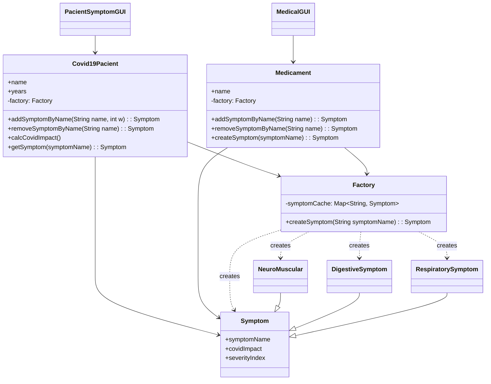

```mermaid
classDiagram
class PacientSymptomGUI

    class MedicalGUI 
    
    class Covid19Pacient {
        +name
        +years
        -factory: Factory
        +addSymptomByName(String name, int w): Symptom
        +removeSymptomByName(String name): Symptom
        +calcCovidImpact()
        +getSymptom(symptomName): Symptom
    }
    
    class Symptom {
        +symptomName
        +covidImpact
        +severityIndex
    }
    
    class NeuroMuscular {
    }
    
    class DigestiveSymptom {
    }
    
    class RespiratorySymptom {
    }
    
    class Medicament {
        +name
        -factory: Factory
        +addSymptomByName(String name): Symptom
        +removeSymptomByName(String name): Symptom
        +createSymptom(symptomName): Symptom
    }
    
    class Factory {
        -symptomCache: Map~String, Symptom~
        +createSymptom(String symptomName): Symptom
    }
    
    PacientSymptomGUI --> Covid19Pacient
    MedicalGUI --> Medicament
    Covid19Pacient --> Symptom
    Medicament --> Symptom
    Covid19Pacient --> Factory
    Medicament --> Factory
    Factory ..> Symptom: creates
    Factory ..> DigestiveSymptom: creates
    Factory ..> NeuroMuscular: creates
    Factory ..> RespiratorySymptom: creates
    NeuroMuscular --|> Symptom
    DigestiveSymptom --|> Symptom
    RespiratorySymptom --|> Symptom
```